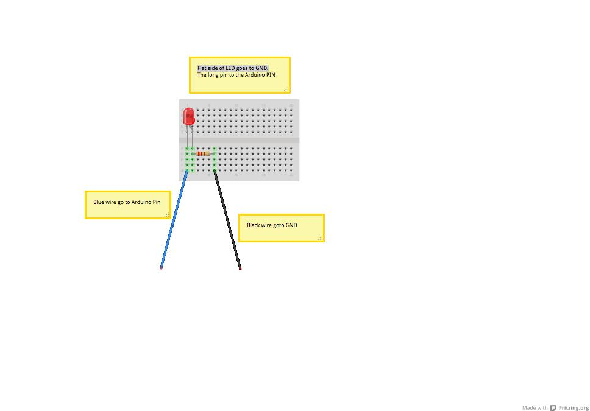

# ObjectOrientationIntroduction

## What is Object Orientation

## Setup

Create a new folder called ```OOIntro``` in your projects folder
* change in the the 'OOIntro' folder
* do a ```npm init```
* do ```npm install --save johnny-five```
* you should be ready to go now

## Javascript Objects

###Object literals
Javascript don't have classes it simulate classes using functions.
Object literals are instances already and are prototypes for new instances. Javascript support prototypal inheritance. Where objects can get functionality by navigating up their prototype chain.

### Function scope

Javascript got function scope and not block scope. You should be carefull and always declare variables first inside of a function.

For example the example below can cause some issues

```

var myFunc = function(count){
	if (count == 7){
		// ola is created in the function as a whole
		var ola = 'ya!'	
	}
	// ola still exists if count is 7
	return ola;
}

```

### 'this' in Javascript

* Be sure to use ```new``` for constructor functions - otherwise they use the global scope!
* Whatch out for the context of ```this``` - is it the right this. Keep a copy of this.

###Inheritence

We will use constructor stealing

```javascript 
var Vehicle = function(regNo){
  var speed = 0;
  
  this.regNo = regNo;
  
  this.accelerate = function(){
    speed += 10;
  };
  
  this.currentSpeed = function(){
    return speed;
  };
}

var Golf = function(regNo){
  Vehicle.call(this, regNo);
};


var golf1 = new Golf('CY 670 234');
console.log(golf1.regNo);

golf1.accelerate();
golf1.accelerate();
golf1.accelerate();

// print 30
console.log(golf1.currentSpeed());


```

### Composition

Create an object that reference other objects

## Arduino and Breadboard Setup

## The Domain

Lights
  * basic light
  * blinking light
    * using inheritance
    * using composition
  * light switch - that can switch both of the above lights on
  
## Breadboard setup

Setup a breadboard that looks like this:




Now create a file called blink.js and add this source code:

```javascript

var five = require("johnny-five");
var board = new five.Board();

board.on('ready', function(){
	
		var pin = new five.Pin(9);
		pin.high();

		setTimeout(function(){
			pin.low();
		}, 1000);

		setTimeout(function(){
			pin.high();
		}, 2000);

		setTimeout(function(){
			pin.low();
		}, 3000);		

});
```

Connect the Arduino to your PC and try to execute this code using nodejs.

What happens?

Now:

* Create a ```Light``` object which can be switched on and off
* Create a ```BlinkingLight``` object that can be switched on and off. One should be able to specify see blinking speed.
* Create a ```LightSwitch``` object that can switch both the Light and the BlinkingLight on and off 

## Usefull

http://node-ardx.org/

