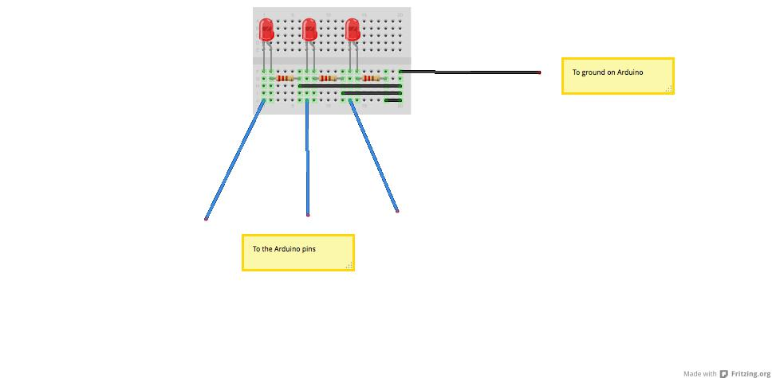

# To car domain

As a toy manufacturer I need software that can control the lights and sounds of a toy car. I need software for a car that can switch on the car's headlights. When the car breaks the headlights should go on and then go of after 3 seconds. When the car turns left or right the indicators should should flickr either left or right. The flickers should switch of after 3 seconds. The software should support a configurable duration horn. Use the supplied hardware abd create software that our engineers would be able to easily integrate into our project.

## Hardware sketch

This hardware skethc will be usefull in this domain

